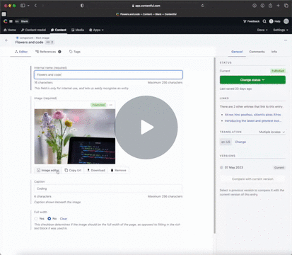
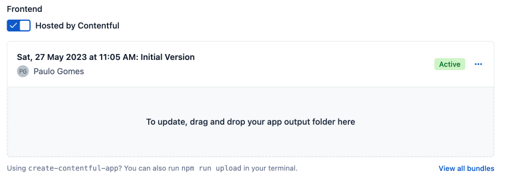
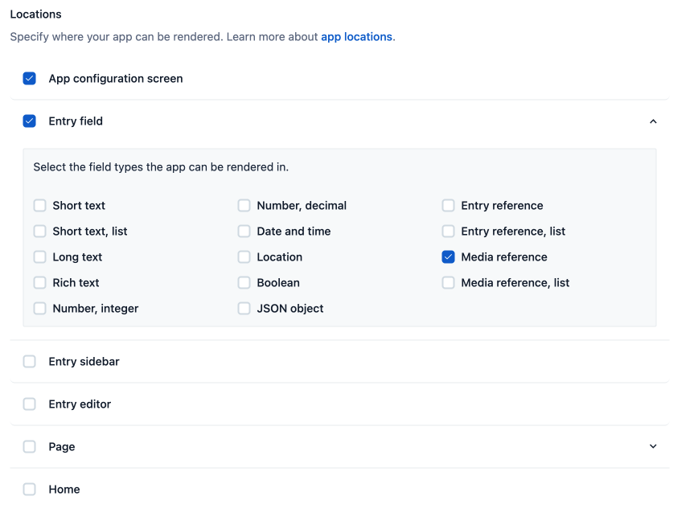
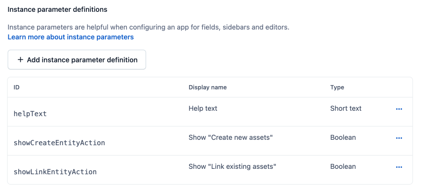
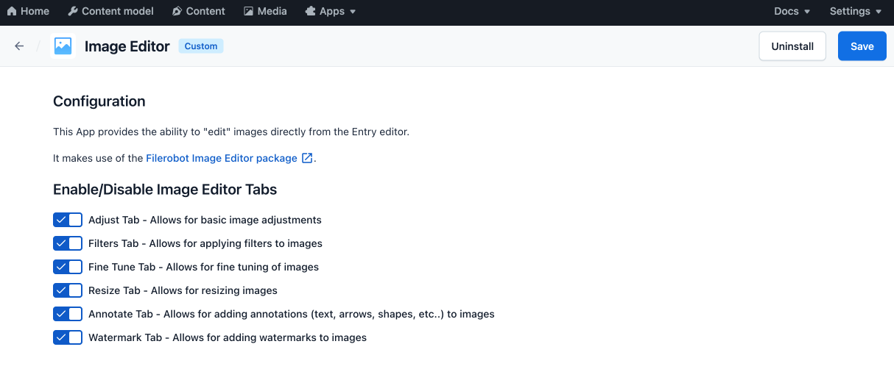
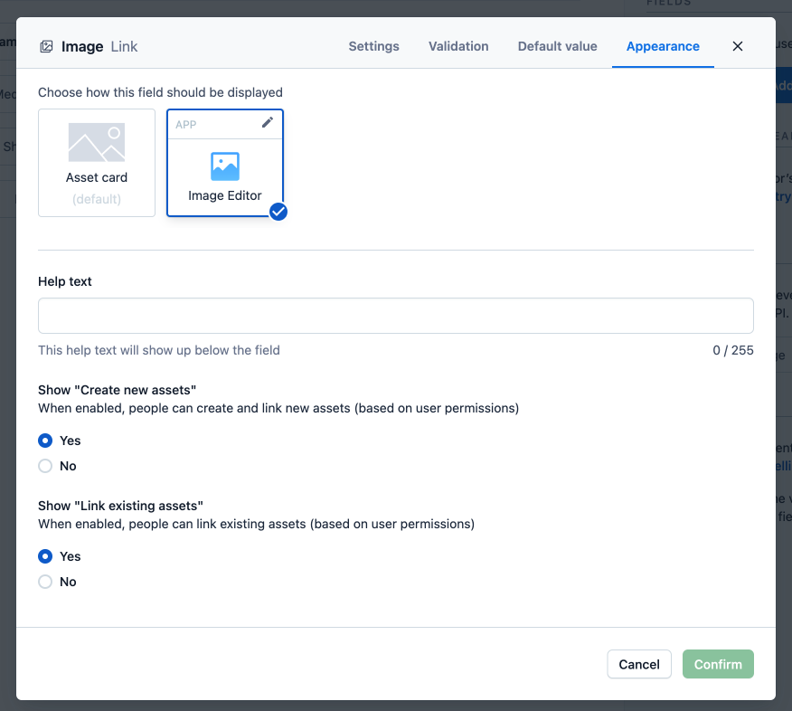
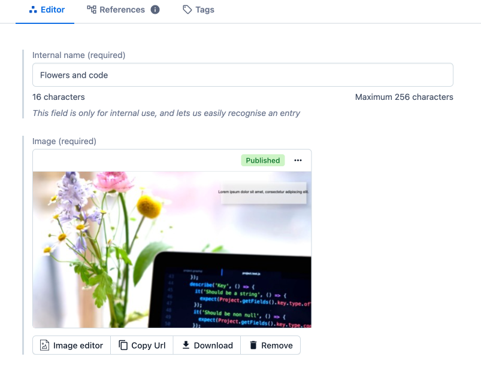

# Contentful Image Editor App

Contentful provides a basic mechanism for resizing and cropping images, which is sufficient in most cases.
However, if you require additional flexibility, you will need to edit your image outside of Contentful and upload it again.
This app integrates with the Filerobot Image Editor (https://github.com/scaleflex/filerobot-image-editor),
enabling you to edit images directly from the Entry editor.
Ideally the Image Editor should be located inside the Asset editor, but Contentful Apps are not allowed there.

## 🛠 Setup

Install the App using by doing the below steps:

1. Create a new Contentful custom App and define the Application Name (e.g. Image Editor)

2. Download this repo and drag the dist folder into the Bundles upload zone:

)

You can find more details about hosting an [Contentful app here](https://www.contentful.com/developers/docs/extensibility/app-framework/hosting-an-app/)

3. Set the App configuration screen and Field locations (media reference only):

4. Create 3 instance parameters ensuring they follow the below naming `helpText`, `showCreateEntityAction`, `showLinkEntityAction`
   exactly as per below screenshot:

5. Save, and Install the App in your space, you can set some defaults for Image Editor UI:

6. Go to Content Models and configure a media reference field (works only with single references) where you want the App:

7. Open an entry of the configured content model and confirm the App is loading:

You'll see below the asset card 4 buttons:

- Image editor: Opens the Filerobot Image Editor
- Copy url: Copy the absolute image url to the clipboard
- Download: Downloads the image (alternate option to Contentful Download)
- Remove: Shortcut for the Contentful asset link removal

## 🥷 Development

Clone this Repo and install dependencies `pnpm install`

In the project directory, you can run:

#### `pnpm run start`

Creates or updates your app definition in Contentful, and runs the app in development mode.
Open your app to view it in the browser.

The page will reload if you make edits.
You will also see any lint errors in the console.

#### `pnpm run build`

Builds the app for production to the `dist` folder.
It correctly bundles React in production mode and optimizes the build for the best performance.

The build is minified and the filenames include the hashes.
Your app is ready to be deployed!

#### `pnpm run upload`

Uploads the `dist` folder to Contentful and creates a bundle that is automatically activated.
The command guides you through the deployment process and asks for all required arguments.
Read [here](https://www.contentful.com/developers/docs/extensibility/app-framework/create-contentful-app/#deploy-with-contentful) for more information about the deployment process.

#### `pnpm run upload-ci`

Similar to `npm run upload` it will upload your app to contentful and activate it. The only difference is
that with this command all required arguments are read from the environment variables, for example when you add
the upload command to your CI pipeline.

For this command to work, the following environment variables must be set:

- `CONTENTFUL_ORG_ID` - The ID of your organization
- `CONTENTFUL_APP_DEF_ID` - The ID of the app to which to add the bundle
- `CONTENTFUL_ACCESS_TOKEN` - A personal [access token](https://www.contentful.com/developers/docs/references/content-management-api/#/reference/personal-access-tokens)

## Learn More

This project was bootstrapped with [Create Contentful App](https://github.com/contentful/create-contentful-app), but using pnpm as package manager.

## Copyright and license

Copyright 2023 pauloamgomes under the MIT license.
